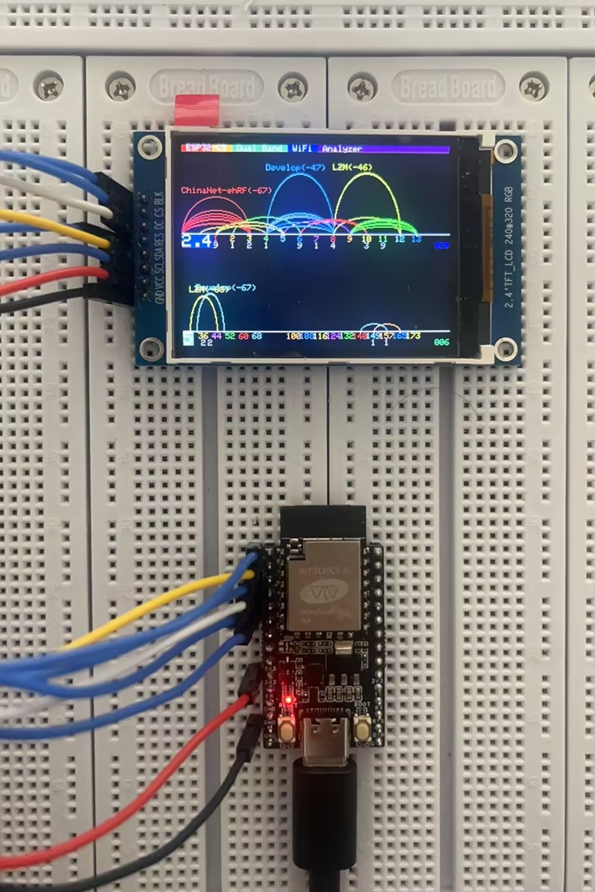

# ESP32-C5 Tiny WiFi Analyzer

## How to Compile and Run

1. Install [Arduino](https://www.arduino.cc/)
2. In `File -> Preferences -> Additional Boards Manager URLs`, add:  
   `https://jihulab.com/esp-mirror/espressif/arduino-esp32/-/raw/gh-pages/package_esp32_index_cn.json`
3. Restart Arduino and install the ESP32 board package  
   > Note: Select the board package authored by `Espressif Systems`
4. Connect the C5 Tiny and select the corresponding COM port in Arduino
5. Open the board selection menu, search for C5, and choose **ESP32C5 Dev Module**
6. Download [Arduino_GFX](https://github.com/moononournation/Arduino_GFX/releases/tag/v1.6.5), extract it, and move it to:  
   `C:\Users\<YourUsername>\Documents\Arduino\libraries`
7. Open `ESP32C5WiFiAnalyzer\ESP32C5WiFiAnalyzer.ino` and install the **U8g2** library in Arduino
8. Compile and upload the firmware to the ESP32C5 Tiny
9. Connect the LCD according to the table below:

   | LCD Pin | ESP32C5 TINY Pin |
   |----------|-------------------|
   | GND      | GND               |
   | VCC      | 3.3V              |
   | SCL      | IO0               |
   | SDA      | IO1               |
   | RES      | IO2               |
   | DC       | IO4               |
   | CS       | IO5               |
   | BLK      | IO6               |

## Result

